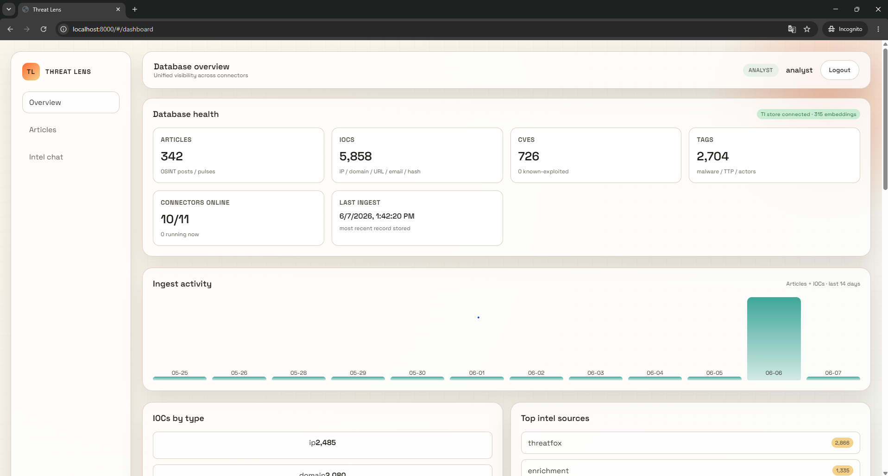
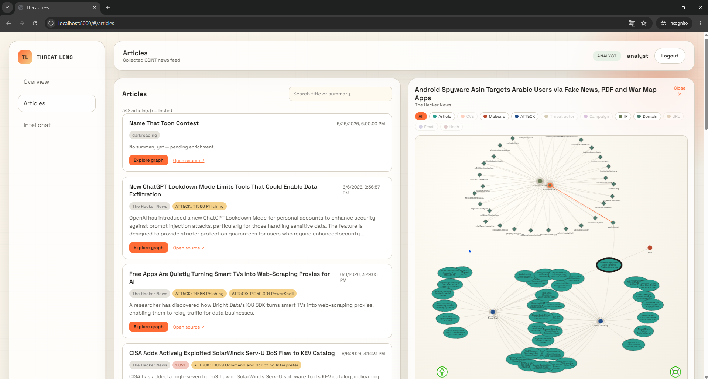
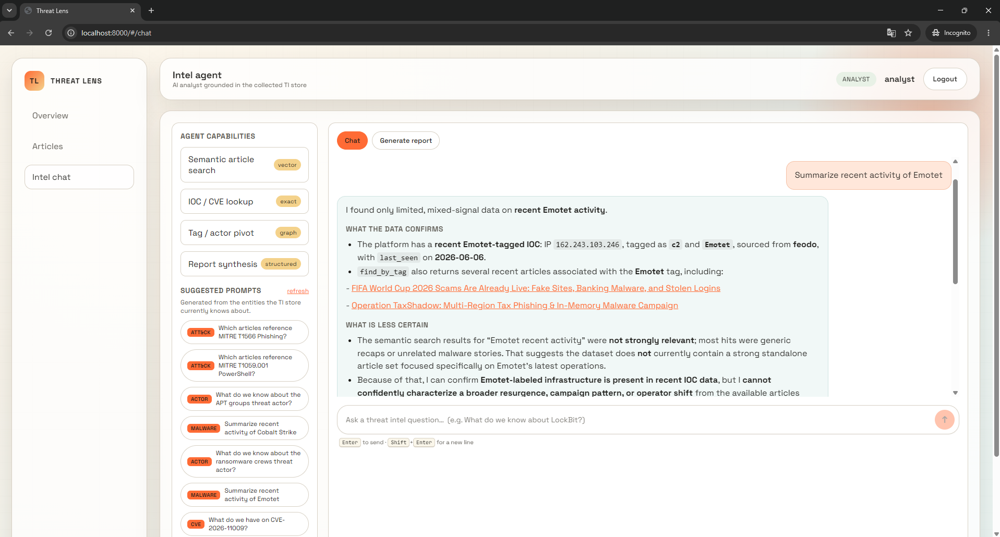
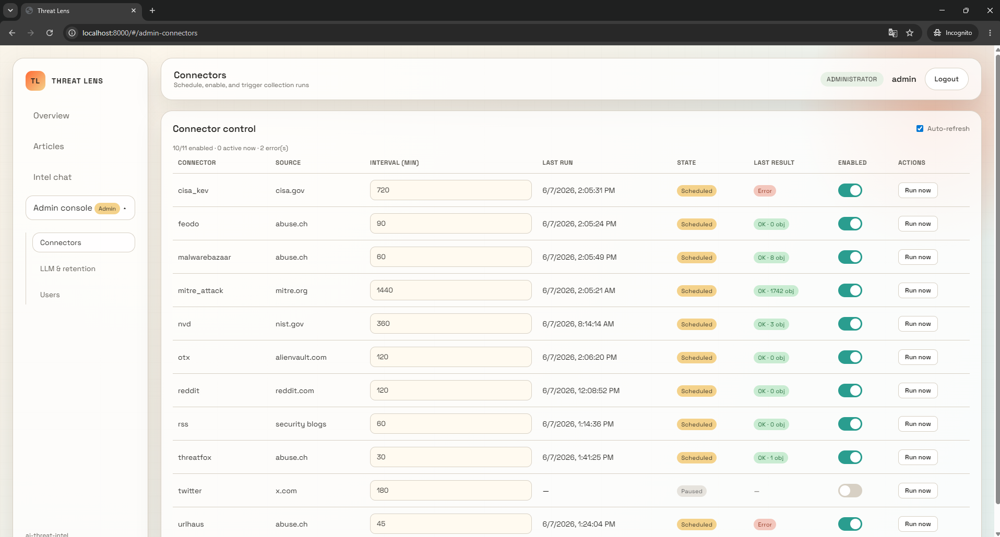

# Sauron - AI threat intelligence
An automated, AI-augmented **threat-intelligence platform**. It collects OSINT
from a dozen sources, normalises everything into a relational store, enriches it
with LLMs and free intel services, and serves it through a single-page web app
with an interactive relationship graph and a tool-calling chat agent.

> Single-tenant, self-hostable, runs entirely from `docker compose up`.

---

## Features

- **11 collectors** — abuse.ch (URLhaus / MalwareBazaar / ThreatFox / Feodo),
  NVD, MITRE ATT&CK, CISA KEV, AlienVault OTX, Reddit, RSS, X/Twitter.
- **Unified TI store** — PostgreSQL holds articles, IOCs, CVEs and a tag
  taxonomy (malware / ATT&CK / actors / campaigns), linked many-to-many.
- **Enrichment pipeline** — a background worker pool that:
  - summarises articles and extracts entities with an LLM;
  - resolves IOC infrastructure (domain → IP) and cross-references it against
    collected blocklists;
  - looks up file hashes on **MalwareBazaar + VirusTotal**;
  - scores CVEs with **EPSS** (exploit-prediction).
- **Interactive graph** — explore an article and pivot through its IOCs, CVEs,
  techniques and shared infrastructure; expand, collapse, filter by entity type.
- **Intel chat agent** — a tool-calling LLM analyst grounded in the store, plus
  a structured report generator.
- **Admin console** — manage connector schedules, LLM providers/routing,
  retention and users from the UI.

---

## Demo

[](https://www.youtube.com/watch?v=1LU_yqyECtk)

---

## Screenshots

| Dashboard | Articles & relationship graph |
|-----------|-------------------------------|
|  |  |

| Intel chat agent | Admin console |
|------------------|---------------|
|  |  |

---

## Architecture

```
 Collectors ──▶ Storage (PostgreSQL) ──▶ Web app (FastAPI + SPA)
  (async,         articles / iocs /        dashboard · articles graph ·
   scheduled)     cves / tags + links      intel chat · admin console
       │                  ▲
       └──▶ Enrichment workers ──┘   (LLM summaries, IOC/CVE/hash intel)
                  │
           ChromaDB (article embeddings for semantic search)
```

| Layer | Path | Role |
|-------|------|------|
| Collectors | [src/collectors/](src/collectors/) | async source connectors + scheduler |
| Storage | [src/storage/](src/storage/) | SQLAlchemy models, ingest, queries, graph |
| Enrichment | [src/enrichment/](src/enrichment/) | job queue + worker pool + enrichers |
| LLM | [src/llm/](src/llm/) | chat agent, report generator, provider routing |
| Web | [src/web/](src/web/) | FastAPI API + static SPA (`src/web/static`) |

---

## Quick start (Docker)

```bash
git clone <your-repo-url> ai-threat-intel && cd ai-threat-intel
cp .env.example .env          # then add your API keys (all optional)
docker compose up -d --build
```

Open **http://localhost:8000** and sign in with the seeded account:

| Username | Password | Role |
|----------|----------|------|
| `admin` | `admin123` | admin |
| `analyst` | `analyst123` | analyst |

> Change these defaults (and `POSTGRES_PASSWORD`) before exposing the app
> anywhere outside localhost.

Compose starts three services: the **app** (`:8000`), **PostgreSQL + pgvector**
(`:5432`), and **ChromaDB** (`:8001`). Connectors and enrichment workers start
automatically; data flows in within a minute or two.

### LLM provider

The chat agent, report generator and article enricher need an LLM. By default
the app points at a local **Ollama** on the host (`host.docker.internal:11434`).
Set the provider, model and any API keys in **Admin → LLM models**, or seed them
via `.env` (`DEFAULT_LLM_PROVIDER`, `OPENAI_API_KEY`, `GOOGLE_API_KEY`, …).

---

## Configuration

All settings live in `.env` (copy from `.env.example`). Every key is optional —
a connector or enricher missing its key simply logs a warning and stays idle.

| Key | Used by | Get it |
|-----|---------|--------|
| `ABUSECH_AUTH_KEY` | URLhaus / MalwareBazaar / ThreatFox / Feodo + hash enrichment | <https://auth.abuse.ch/> |
| `OTX_API_KEY` | AlienVault OTX | <https://otx.alienvault.com/api> |
| `NVD_API_KEY` | NVD (raises rate limit) | <https://nvd.nist.gov/developers/request-an-api-key> |
| `VT_API_KEY` | VirusTotal hash enrichment | <https://www.virustotal.com> |
| `REDDIT_CLIENT_ID` / `_SECRET` | Reddit (else rate-limited public JSON) | <https://www.reddit.com/prefs/apps> |

> `.env` is gitignored — keep real keys there. `.env.example` is the committed
> template and ships with empty placeholders.

---

## Local development (without the app container)

```bash
python -m venv .venv
# Windows: .\.venv\Scripts\python -m pip install -r requirements.txt
# Unix:    ./.venv/bin/pip install -r requirements.txt

docker compose up -d db chroma          # just the data services
python -m src.storage.cli init-db       # create the schema
python -m src.web                        # run the API + SPA on :8000
```

Storage CLI helpers:

```bash
python -m src.storage.cli init-db [--reset]   # --reset drops + recreates (wipes data)
python -m src.storage.cli stats               # dashboard aggregations
python -m src.storage.cli search "qakbot"     # keyword search
python -m src.storage.cli lookup 1.2.3.4      # IOC lookup
```

---

## Data model

One PostgreSQL database holds both the intelligence and the app state.

| Tables | Hold |
|--------|------|
| `articles`, `iocs`, `cves`, `tags` | collected threat intelligence |
| `article_iocs`, `article_cves`, `article_tags`, `ioc_relations` | many-to-many links that power the graph |
| `enrichment_jobs` | background enrichment queue |
| `users`, `sessions`, `connector_settings`, `retention_policy`, `llm_*` | app / admin state |

IOCs are globally unique by `(type, value)` and linked to every article that
references them; `ioc_relations` records discovered infrastructure edges
(e.g. a domain that resolves to an IP), so the graph can pivot across reports.
Article content is embedded into ChromaDB for semantic retrieval.

---

## Tech stack

Python · FastAPI · SQLAlchemy (async) · PostgreSQL + pgvector · ChromaDB ·
LangChain (OpenAI / Gemini / Ollama) · vanilla-JS SPA with vis-network.

---

## Security notes

Default credentials and the sample database password are **for local dev only**.
This is a single-tenant tool; do not expose it to untrusted networks without
changing the secrets and putting it behind proper authentication.
